# Práctica 1. Carga y modelado de datos 

## Objetivos:
Al finalizar la práctica, serás capaz de:
- Cargar datos a Power BI Destkop.
- Crear relaciones y jerarquías.

## Duración aproximada:
- 60 minutos.

---

**[Lista general](https://netec-mx.github.io/PBI_ESS-Priv/)** | **[Siguiente ➡️](https://netec-mx.github.io/PBI_ESS-Priv/Cap%C3%ADtulo2/)**

---

## Instrucciones:

**Descripción:** Imagina a un analista en una empresa de artículos deportivos que busca entender cómo varían las ventas según el tipo de producto, región y revendedor. Para lograrlo, su meta es construir un modelo de datos claro y conectado, con el fin de responder preguntas clave, tales como: 

- ¿Qué productos se venden más en cada zona?
- ¿Qué tipo de revendedor genera más ingresos?
- ¿Cómo cambian las ventas según el mes o país?

> 💡 ***Nota:** Para completar este ejercicio, usa el archivo **"AdventureWorks Sales"** en formato *.xls*, el cual encontrarás en el repositorio del curso.* 

---

### Tarea 1. Obtención de datos en Power BI.

Para iniciar, abre **Power BI Desktop** y crea un nuevo informe en blanco.

1. En la cinta de opciones, selecciona la pestaña **Inicio** y haz clic en **Obtener datos ➡️ Libro de Excel**.

    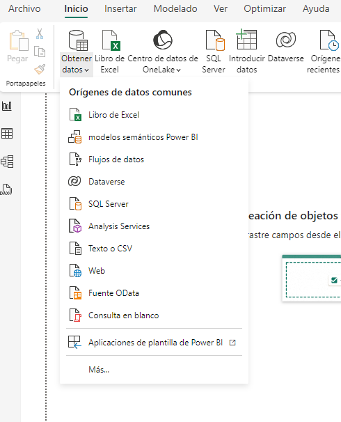

2. Realiza la carga de datos en Power BI desktop del archivo **_“AdventureWorks Sales.xlsx”_**.

3. En la ventana **Navegador**, puedes ver todas las opciones disponibles para cargar datos. Allí se muestran las tablas y hojas de cálculo contenidas en el archivo que cargaste. Selecciona las siguientes tablas y luego haz clic en **Cargar**.
 
   - Customer
   - Date  
   - Product  
   - Reseller  
   - Sales  
   - SalesOrder  
   - SalesTerritory

    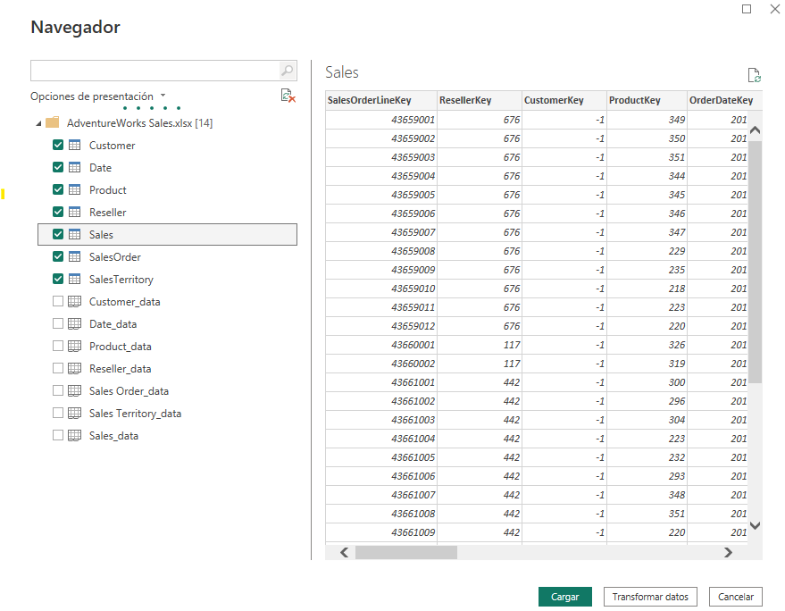

    > 💡 ***Nota**: Es recomendable usar tablas, ya que Power BI trabajará mejor con un conjunto de datos bien organizado, lo que facilita el proceso de limpieza, modelado y visualización.*

4. En la pestaña **Vista de Tabla**, podrás visualizar los datos que has cargado. Después, en cada columna examina el tipo de dato, los valores, la categoría y el formato.

    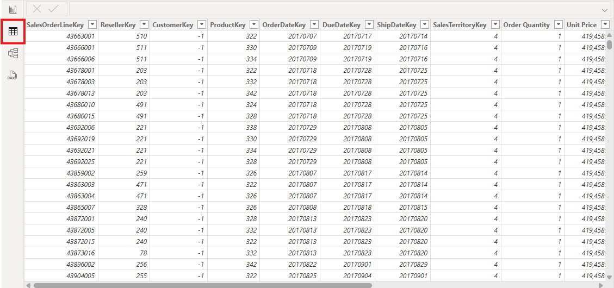

---

### Tarea 2. Crear relaciones en la vista de modelo.

1. Dirígete a la **vista de modelo** (ícono de diagrama).

    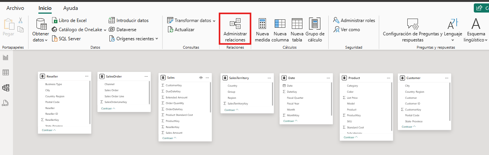

2. En **Administrar relaciones**, da clic. Después, selecciona **+ Nueva Relación**.

    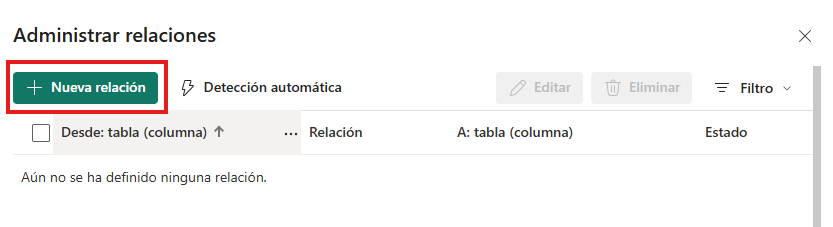

3. Ahora, crea las siguientes relaciones de forma manual:

    | Tabla origen | Columna        | Tabla destino | Columna        | Cardinalidad | Dirección de filtro cruzado |
    |--------------|----------------|----------------|----------------|--------------|----------------|
    | `Sales`      | CustomerKey     | `Customer`      | CustomerKey      | 1:*  | Único
    | `Sales`      | OrderDateKey     | `Date`      | DateKey      | 1:* | Único
    | `Sales`      | ProductKey      | `Product`      | ProductKey      | 1:* | Único 
    | `Sales`      | ResellerKey      | `Reseller`      | ResellerKey      | 1:* | Único
    | `Sales`      | SalesTerritoryKey | `Territory`   | SalesTerritoryKey | 1:*  | Único
    | `Sales`      | SalesOrderLineKey    | `SalesOrder`     | SalesOrderLineKey    | 1:1  | Ambas |

    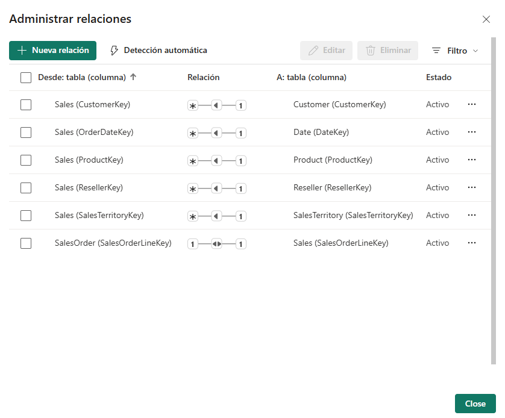

    > 💡 ***Nota:** Asegúrate de que las relaciones estén **activas***.

4. Finalmente, verifica que las relaciones creadas sean correctas y valida que se cumplan.

    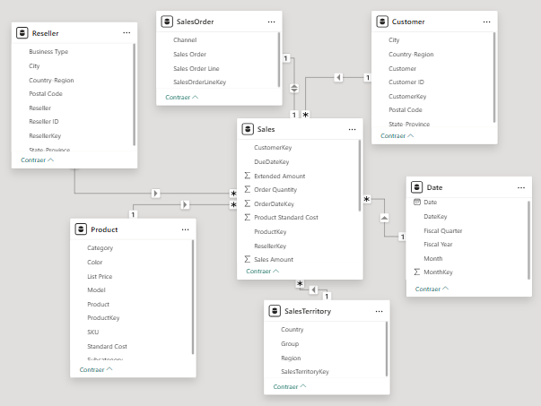

---

### Tarea 3. Crear jerarquías.

#### 1. Jerarquía de Estado-Ciudad:

1. En la tabla `Customer`, crea una jerarquía llamada `Estado-Ciudad`.
2. Luego, añade los distintos niveles:
   - `Country-Region`
   - `State-Province`
   - `City`

        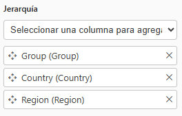

#### 2. Jerarquía de Tiempo:

1. En la tabla `Date`, crea una jerarquía llamada `Fiscal`.
2. Posteriormente, añade los niveles siguientes:
   - `Fiscal Year`
   - `Fiscal Quarter`
   - `Month`
   
        

#### 3. Jerarquía de Productos:

1. En la tabla `Product`, crea una jerarquía llamada `Productos`.
2. De la misma forma, añade los niveles:
   - `Category`
   - `Subcategory`
   - `Month`

        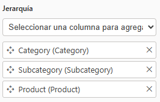

#### 4. Jerarquía de Revendedores:

1. En la tabla `Reseller`, crea una jerarquía llamada `Resellers`.
2. Asimismo, añade los niveles siguientes:
   - `Reseller`
   - `Business Type`
        
        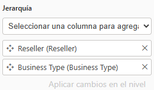

#### 5. Jerarquía de Geografía:

1. En la tabla `SalesTerritory`, crea una jerarquía llamada `Geografía`.
2. A continuación, añade los niveles:
   - `Group`
   - `Country`
   - `Region`

        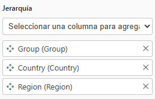

---

### Tarea 4. Validación del modelo.

1. Abre la **Vista de informe**.

2. Después, crea una visualización de tipo ***Gráfico de columnas apiladas***.
-  Añade a los campos:
    -   Eje X: **Product [Category]**.
    -   Eje Y: **Sales [Sales Amount]**.

    |||
    |--------------|----------------|
    | 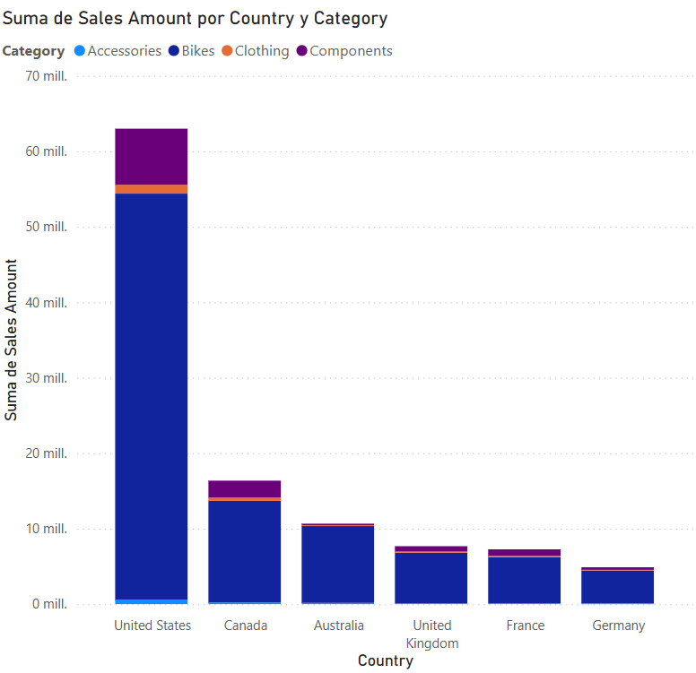      | 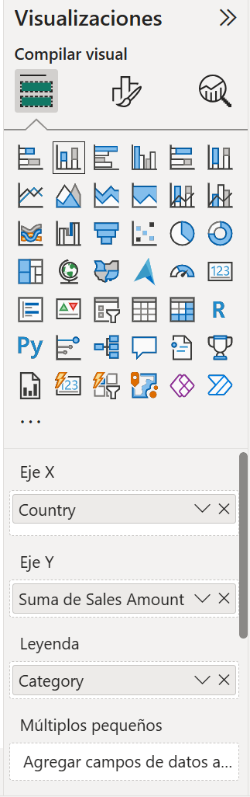      |
    
3. Luego, crea una visualización de tipo ***Tabla***.
- Añade al campo **columnas**:
    - **Product [Product]**
    - **Sales [Sales Amount]**
    - **Sales [Total Product Cost]**

    |||
    |--------------|----------------|
    | 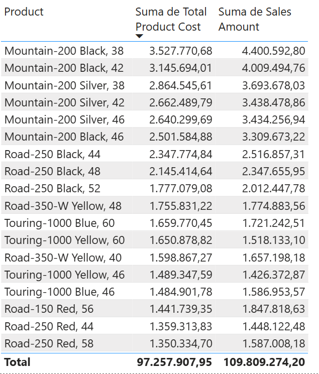      | 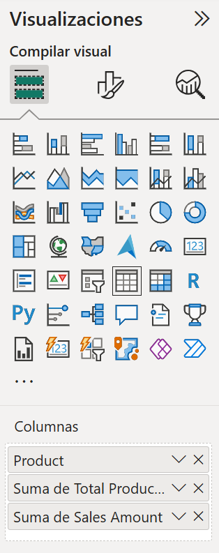      |
    
4. Crea un cuadro de texto y escribe lo siguiente: **"Práctica 1. Carga y modelado de datos"**.
    ||
    |--------------|
    | 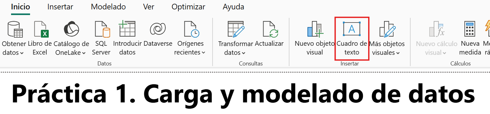 |
    
---

### Tarea 5. Medidas rápidas.

En esta tarea vas a crear dos medidas rápidas para calcular los beneficios y el margen de beneficio. Una medida rápida genera automáticamente la fórmula necesaria para realizar el cálculo. Son fáciles y rápidas de crear para cálculos simples y comunes.

1. En el panel de **Datos**, haz clic derecho sobre la tabla **Sales** y selecciona la opción **Nueva medida rápida**.

     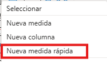

2. En la ventana **Medida rápida**, abre la lista desplegable **Cálculo**. Dentro del grupo **Operaciones matemáticas**, selecciona la opción **Resta**.

     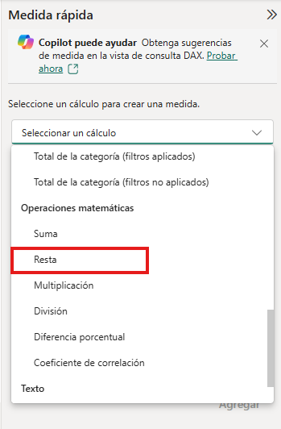

3. En el panel **Datos** de la ventana **Medida rápida**, despliega la tabla **Sales**.

4. Arrastra el campo **Sales Amount** al cuadro **Valor base**.

5. De la misma forma, arrastra el campo **Total Product Cost** al cuadro **Valor que se restará**. Luego, haz clic en **Agregar**.  

     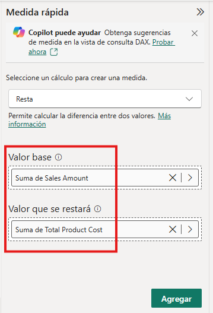

6. En el panel **Datos**, dentro de la tabla **Sales**, observa la nueva medida. 

    > 💡 ***Nota:** Las medidas se indican mediante el ícono de la calculadora.*

     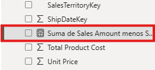

7. Para cambiar el nombre de la medida, haz clic con el botón derecho sobre ella, selecciona **Cambiar nombre** y proporciónale el nombre **Profit**.

    > 🧠 ***Sugerencia:** Para modificar el nombre de un campo, también puedes hacer doble clic sobre él, o bien, selecciónalo y presiona **F2**.*

8. En la tabla **Sales**, añade una segunda medida rápida siguiendo los requisitos que se indican a continuación:

     - Utiliza la operación matemática **División**.
     - Establece el **Numerador** dentro del campo **Sales [Profit]**.
     - Establece el **Denominador** en el campo **Sales [Sales Amount]**.
     - Cambia el nombre de la medida por **Profit Margin**.

9. Asegúrate de que la medida **Profit Margin** esté seleccionada. Luego, en la cinta contextual **Herramientas de medición**, establece el formato en **Porcentaje** y ajusta las posiciones decimales a dos.

     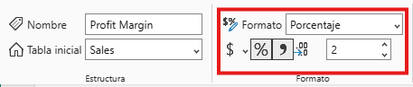

10. Las medidas creadas deben quedar dentro de la tabla **Sales**.

    > 💡 ***Nota:** En las siguientes prácticas, usarás las médidas rápidas que creaste como un recurso complementario para facilitar el análisis de los datos.*

     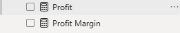

---
### Tarea 6. Guardar archivo.

Ahora que ya tienes los datos cargados, el modelo construido y comprobado, es importante **guardar** el informe y asignarle un nombre.

1. Haz clic en **Archivo** en la cinta de opciones.
2. Selecciona **Guardar** o **Guardar como**.
    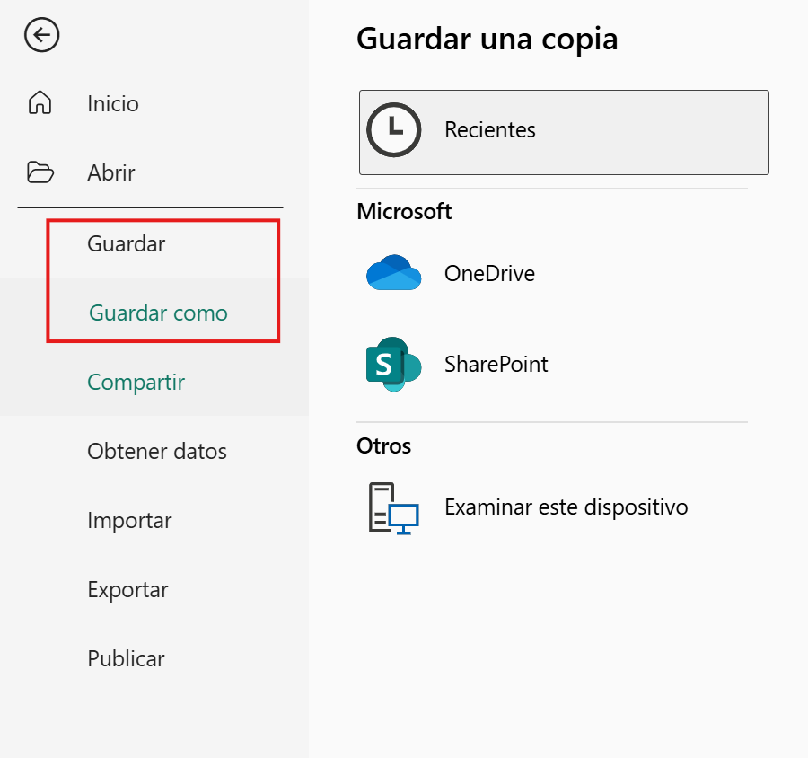
3. Selecciona la **Ubicación** del archivo y asígnale el nombre: **"Curso_PBI_BAS"**.

> 💡 ***Nota:** Este archivo se utilizará en los próximos laboratorios. Guarda el informe en un lugar accesible y con un nombre fácil de identificar para que puedas acceder facilmente a la información.*

## Resultado esperado:

Al finalizar la práctica, se espera que el resultado que obtengas sea similar al de la siguiente imagen:

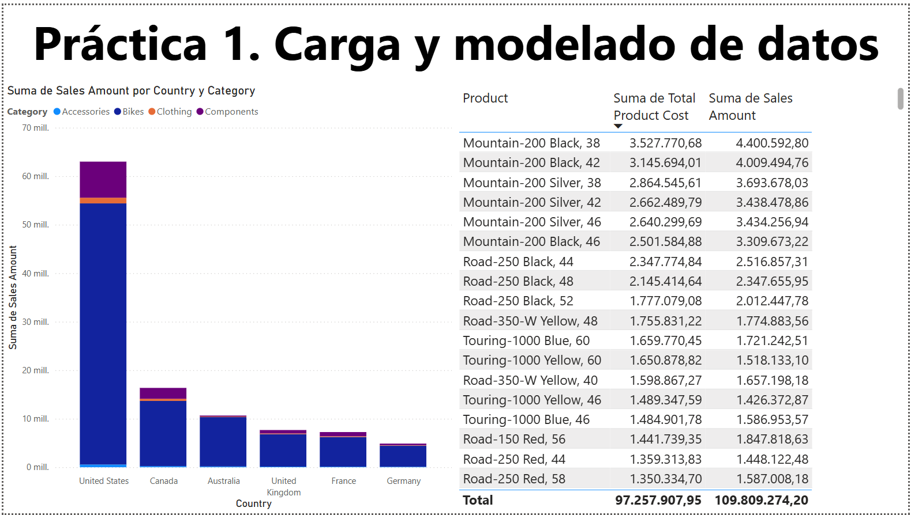

---

**[Lista general](https://netec-mx.github.io/PBI_ESS-Priv/)** | **[Siguiente ➡️](https://netec-mx.github.io/PBI_ESS-Priv/Cap%C3%ADtulo2/)**
