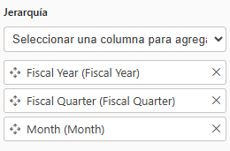

# Práctica 1. Carga y modelado de datos 

## Objetivo de la práctica:
Al finalizar la práctica, serás capaz de:
- Cargar datos a Power BI Destkop
- Crear relaciones
- Crear Jerarquías

## Duración aproximada:
- 60 minutos.

## Instrucciones
**Descripción:** Imagina a un analista en una empresa de artículos deportivos que busca entender cómo varían las ventas según el tipo de producto, región y revendedor. Su meta es construir un modelo de datos claro y conectado, para responder preguntas clave como: ¿Qué productos se venden más por zona? ¿Qué tipo de revendedor genera más ingresos? ¿Cómo cambian las ventas según el mes o el país?

>***Nota:** Para completar este ejercicio, usa el archivo que se encuentra en el repositorio del curso **"AdventureWorks Sales"** de formato .xls*

---
<!-- Proporciona pasos detallados sobre cómo configurar y administrar sistemas, implementar soluciones de software, realizar pruebas de seguridad, o cualquier otro escenario práctico relevante para el campo de la tecnología de la información -->
### Tarea 1. Obtención de dato en Power BI.
Abre **Power BI Desktop** y crea un nuevo informe en blanco.

1. Selecciona la pestaña **Inicio** de la cinta de opciones y haz clic en **Obtener datos > Libro de Excel.**
   
    

2. Realiza la carga de datos en Power BI desktop del archivo **_“AdventureWorks Sales.xlsx”_**.

3. En la ventana **Navegador** encontrarás las opciones que se disponen para cargar datos. Se muestra las tablas y las hojas de cálculo que se encuentran en el archivo cargado. Selecciona las siguientes tablas y luego haz clic en **Cargar**.
   - Customer
   - Date  
   - Product  
   - Reseller  
   - Sales  
   - SalesOrder  
   - SalesTerritory

    

    > ***Nota**: Es recomendable usar tablas, ya que Power BI trabajará mejor con un conjunto de datos bien organizado, lo que facilita el proceso de limpieza, modelado y visualización.*

4. En la pestaña **Vista de Tabla** podrá visualizar los datos cargados. Examinar en cada columna el tipo de dato, valores, categoría y formato.

    

---

### Tarea 2. Crear relaciones en la vista de modelo

1. Ve a la **vista de modelo** (icono de diagrama).
    

2. En **Administrar relaciones** dar clic.
    

3. Crea las siguientes relaciones manualmente:

    | Tabla origen | Columna        | Tabla destino | Columna        | Cardinalidad | Dirección de filtro cruzado |
    |--------------|----------------|----------------|----------------|--------------|----------------|
    | `Sales`      | CustomerKey     | `Customer`      | CustomerKey      | 1:*  | Único
    | `Sales`      | OrderDateKey     | `Date`      | DateKey      | 1:* | Único
    | `Sales`      | ProductKey      | `Product`      | ProductKey      | 1:* | Único 
    | `Sales`      | ResellerKey      | `Reseller`      | ResellerKey      | 1:* | Único
    | `Sales`      | SalesTerritoryKey | `Territory`   | SalesTerritoryKey | 1:*  | Único
    | `Sales`      | SalesOrderLineKey    | `SalesOrder`     | SalesOrderLineKey    | 1:1  | Ambas
    |

    

    > ***Nota:** Asegúrate de que las relaciones estén **activas***.

4. Verificar que las relaciones creadas y validar que cumplan

    

---
### Tarea 3. Crear Jerarquías
#### 1. Jerarquía de Estado-Ciudad

1. En la tabla `Customer`, crea una jerarquía llamada `Estado-Ciudad`.
2. Añade los niveles:
   - `Country-Region`
   - `State-Province`
   - `City`

        

#### 2. Jerarquía de Tiempo

1. En la tabla `Date`, crea una jerarquía llamada `Fiscal`.
2. Añade los niveles:
   - `Fiscal Year`
   - `Fiscal Quarter`
   - `Month`
   
        

#### 3. Jerarquía de Productos

1. En la tabla `Product`, crea una jerarquía llamada `Productos`.
2. Añade los niveles:
   - `Category`
   - `Subcategory`
   - `Month`

        

#### 4. Jerarquía de Revendedores

1. En la tabla `Reseller`, crea una jerarquía llamada `Resellers`.
2. Añade los niveles:
   - `Reseller`
   - `Business Type`
        
        

#### 5. Jerarquía de geografía

1. En la tabla `SalesTerritory`, crea una jerarquía llamada `Geografia`.
2. Añade los niveles:
   - `Group`
   - `Country`
   - `Region`

        

---

### Tarea 4. Validación del modelo

1. Abre la **vista de informe**.

2. Crea una visualización tipo ***Gráfico de columnas apiladas***.
-  Añade a los campos:
    -   Eje X: **Product [Category]**
    -   Eje Y: **Sales [Sales Amount]**

    |||
    |--------------|----------------|
    |       |       |
    |

3. Crea una visualización tipo ***Tabla***.
- Añade al campo **columnas**:
    - **Product [Product]**
    - **Sales [Sales Amount]**
    - **Sales [Total Product Cost]**

    |||
    |--------------|----------------|
    |       |       |
    |
4. Crea un cuadro de texto y agregar: **"Práctica 1. Carga y modelado de datos"**
    ||
    |--------------|
    |  |
    |
---

### Tarea 5. Medidas rápidas

En esta tarea creará dos medidas rápidas para calcular los beneficios y el margen de beneficio. Una medida rápida crea el fórmula de cálculo de forma automática. Son fáciles y rápidas de crear para cálculos simples y comunes.

1. En el panel **Datos**, haga clic con el botón derecho en la tabla **Sales** y seleccione **Nueva medida rápida**.

     

1. En la ventana **Medida rápida**, en la lista desplegable **Cálculo**, en el grupo **Operaciones matemáticas**, seleccione **Resta**.

     

1. En el panel **Datos** de la ventana **Medida rápida**, expanda la tabla **Sales**.

1. Arrastre el campo **Sales Amount** al cuadro **Valor base**.

1. Arrastre el campo **Total Product Cost** al cuadro **Valor que se restará**, a continuación seleccione **Agregar**.  

     

1. En el panel **Datos**, dentro de la tabla **Sales**, observe la nueva medida. 
    > *Las medidas se indican mediante el icono de la calculadora.*

     

1. Para cambiar el nombre de la medida, haga clic con el botón derecho en ella, seleccione **Cambiar nombre** y dele el nombre **Profit**.

    > *Sugerencia: Para cambiar el nombre de un campo, también puede hacer doble clic en él, o bien seleccionarlo y presionar **F2**.*

1. En la tabla **Sales**, agregue una segunda medida rápida, en función de los requisitos siguientes:

     - Use la operación matemática **División**.
     - Establezca el **Numerador** en el campo **Sales [Profit]**.
     - Establezca el **Denominador** en el campo **Sales [Sales Amount]**.
     - Cambie el nombre de la medida por **Profit Margin**.

1. Asegúrese de que la medida **Profit Margin** está seleccionada y, después, en la cinta contextual **Herramientas de medición**, establezca el formato en **Porcentaje**, con dos posiciones decimales.

     

1. Las medidas creadas deben quedar dentro de la tabla **Sales**
    > ***Nota:** Para las siguientes prácticas se utilizarán las médidas rápidas creadas como un recurso complementario para facilitar el análisis de los datos.*

     

---
### Tarea 6. Guardar archivo
Ahora cuenta con datos cargados, un modelo de datos construido y la comprobación del mismo. Ahora, es importante **guardar** el informe y colocarle un nombre.

1. Dar clic en **Archivo** de la cinta de opciones
2. Seleccionar **Guardar o Guardar Como**
    
3. Seleccionar **Ubicación** del archivo y darle el nombre de: **"Curso_PBI_BAS"**.

> ***Nota:** El archivo guardado se usará para siguientes laboratorios, selecciona un lugar y un nombre para acceder facilmente a la información.*

### Resultado esperado
Al finalizar el laboratorio se espera que el resultado sea similar a la siguiente imágen:

---
