# Práctica 2. Creación de informe y mejora en la experiencia de usuario

## Objetivo de la práctica:

Al finalizar la práctica, serás capaz de:
- Diseñar un informe en Power BI con visualizaciones adecuadas, elementos interactivos y un enfoque centrado en la experiencia del usuario.

## Duración aproximada:
- 60 minutos.

---

**[⬅️ Atrás](https://netec-mx.github.io/PBI_ESS-Priv/Cap%C3%ADtulo1/)** | **[Lista general](https://netec-mx.github.io/PBI_ESS-Priv/)** | **[Siguiente ➡️](https://netec-mx.github.io/PBI_ESS-Priv/Cap%C3%ADtulo3/)**

---
## Instrucciones:

**Descripción:** Después de construir un modelo de datos estructurado en la primera práctica, el siguiente paso es transformar esa base en un informe funcional, claro y orientado al análisis. A partir de las relaciones entre productos, regiones, revendedores y periodos de tiempo, tu objetivo será crear visualizaciones que destaquen patrones clave y faciliten la exploración de los datos.

Esta práctica se enfoca en diseñar una experiencia visual efectiva utilizando segmentaciones, jerarquías, tooltips y gráficos adecuados para cada tipo de información. El objetivo es que el informe final no solo comunique datos, sino que también permita interactuar con ellos de forma intuitiva y con criterio analítico.

> 💡***Nota:** En esta práctica utilizarás el archivo resultante del laboratorio anterior: **PBI_ESS_PRIV.pbix***.

---

### Tarea 1. Diseñar la primera página del informe.

1. En el panel de **Vistas**, selecciona la opción **Vista de informe**.

2. En la parte inferior, añade una página para trabajar en un nuevo **lienzo de informe**.

 

En este ejercicio, diseñarás un informe.

3. Agregar una página nueva en el informe. Para cambiar el nombre de la página en Power BI Desktop, en la parte inferior izquierda, haga clic con el botón derecho en **Página 2**, elija **Cambiar nombre de página** y dele el nombre **Información general**.

    > 🧠 ***Sugerencia:** También puede hacer doble clic en el nombre de la página para cambiarle el nombre.*

4. Para añadir una imagen, ve a la pestaña **Insertar** en la cinta de opciones. En el grupo **Elementos**, selecciona **Imagen**.

    

5. En la ventana **Abrir**, dirígete a la carpeta del repositorio del curso.
6. Selecciona el archivo **Logo.png** y, posteriormente, da clic en **Abrir**.
7. Arrastra la imagen y colócala en la esquina superior izquierda del lienzo. Usa los marcadores de guía para ajustar su tamaño.

     

8. Para agregar una segmentación, primero anula la selección de la imagen. Para ello, haz clic en un área vacía de la página del informe. A continuación, en el panel **Visualizaciones**, selecciona el ícono de **Segmentación** .

     

9. En el panel **Datos**, arrastra el campo **Date [Fiscal Year]** directamente (no el nivel **Año** de la jerarquía) a la segmentación **Campo**, en el panel Visualizaciones.

10. Para cambiar la segmentación de lista en una lista desplegable, ve a: **Visualizaciones ➡️ Objeto visual ➡️ Visual ➡️ Configuración de segmentación ➡️ Estilo**, y en la lista desplegable selecciona **Menú desplegable**.

    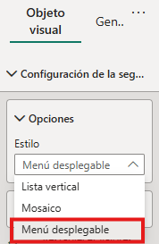

11. Ajusta el tamaño y coloca la segmentación justo debajo de la imagen. Asegúrate de que tenga el mismo ancho que la imagen.

     

12. En la segmentación **Fiscal Year**, abre la lista desplegable, selecciona **FY2020** y luego contrae nuevamente la lista.

    > 💡***Nota:** La página del informe ahora se filtra por el año **FY2020**.*

     

13. Haz clic en un área vacía del lienzo para anular la selección de la segmentación actual.
14. Crea una segunda segmentación usando el campo **SalesTerritory [Región]** (no en el nivel **Región** de la jerarquía).
15. Deja la segmentación en forma de lista. Luego cambia su y colócala debajo de la segmentación **Fiscal Year**.

     

16. Haz clic en un área vacía de la página del informe para anular la selección de la segmentación.

17. Para agregar un gráfico a la página, ve al panel **Visualizaciones** y selecciona objeto visual **Gráfico de columnas apiladas y de líneas**.

     

18. Cambia el tamaño del objeto visual y colócalo a la derecha del logotipo, de modo que ocupe el resto del ancho de la página del informe.

     

19. Arrastra y coloca los siguientes campos al objeto visual:

     - **Date [Month]**.
     - **Sales [Sales Amount]**.

20. En el panel de campos del objeto visual (situado debajo del panel **Visualizaciones**), asegúrate de que los campos están asignados a las áreas **Eje X** y **Eje Y de columna**.

    > 💡***Nota:** Si arrastras campos a un objeto visual, se agregarán a los apartados o áreas predeterminadas. Para tener mayor precisión, puedes arrastrarlos  directamente a los apartados o áreas específicas, como harás a continuación.*

     

21. En el panel **Datos**, arrastra el campo **Sales [Profit Margin]** al área **Eje Y de línea**.

     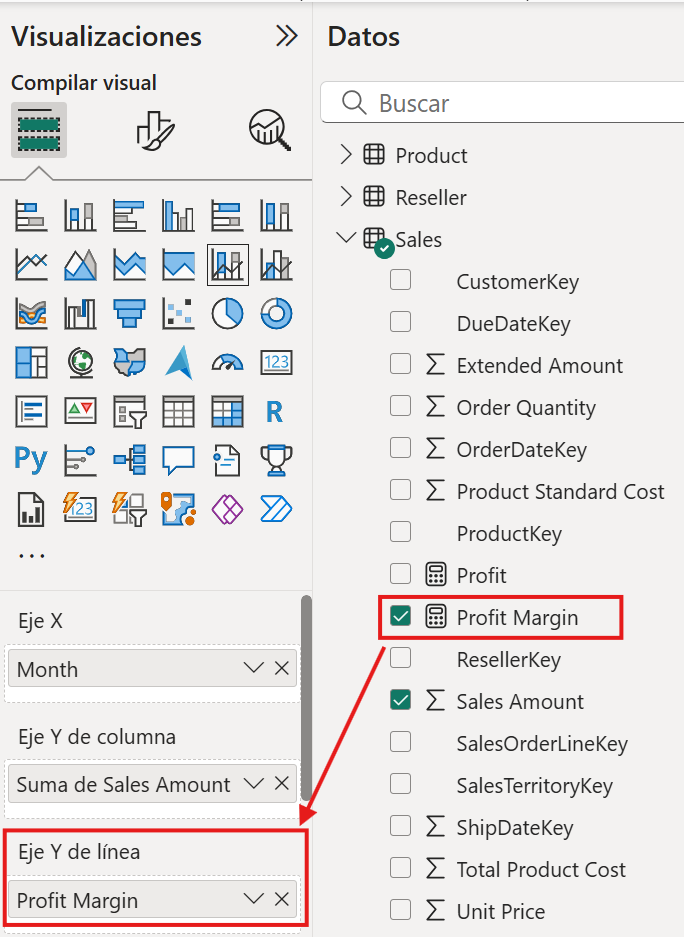

22. Haz clic en un área vacía de la página del informe para anular la selección del gráfico.

23. Ahora, para agregar un gráfico a la página, dirígete al panel **Visualizaciones** y selecciona el tipo de objeto visual **Gráfico de barras apiladas**.

     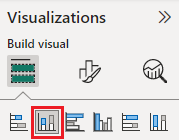

24. Cambia el tamaño del objeto visual y colócalo debajo del gráfico de columnas o líneas, de manera que ocupe la mitad del ancho del gráfico anterior.

     

25. Añade los siguientes campos a los apartados o áreas del objeto visual:

     - Eje X: **SalesTerritory [Country]**.
     - Eje Y: **Sales [Sales Amount]**.
     - Leyenda: **Product [Category]**.

26. Haz clic en un área vacía de la página del informe para anular la selección del gráfico.

27. Para agregar un gráfico a la página, ve al panel **Visualizaciones** y haz clic en el tipo de objeto visual **Gráfico de barras apiladas**.

     

28. Cambia el tamaño del objeto visual y colócalo de modo que rellene el espacio restante de la página del informe.

     

29. Agrega los siguientes campos a los apartados o áreas del objeto visual:

     - Eje Y: **Product [Category]**.
     - Eje X: **Sales [Order Quantity]**.

30. Para dar formato al objeto visual, abre el panel **Formato**.

     

31. Expande las opciones de **Barras** y el grupo **Color**, luego establece la propiedad **Color predeterminado** con un color de tu preferencia (que complemente el gráfico de columnas o líneas).

32. Después, establece la propiedad **Etiquetas de datos** como **activada**.

     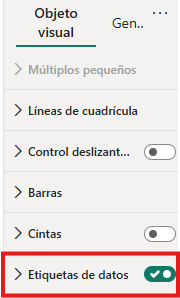

33. Guarda el archivo de Power BI Desktop.

     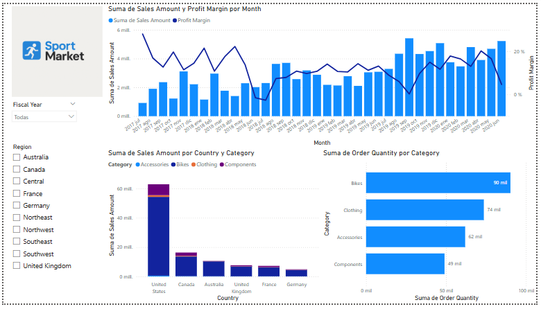

✅ *¡Listo! Has completado el diseño del informe.*

---

### Tarea 2. Diseñar la segunda página del informe.

Para crear una nueva página, selecciona el ícono de signo más **(+)** que se encuentra en la parte inferior izquierda y cambia el nombre de la página a **Profit**.

1. Añade segmentaciones basadas en los campos **SalesTerritory [Region]** y **Date [Fiscal Year]**. 
2. Usa el panel **Formato** para habilitar la opción “Seleccionar todo”, dentro del grupo **Configuración de la segmentación > Selección**.
3. Cambia el tamaño de las segmentaciones y colócalas en el lado izquierdo de la página del informe.
4. Agrega un objeto visual de **matriz**, cambia su tamaño y colócalo a la derecha del segmentador, en la parte superior. Debe ocupar el resto del ancho de la página.
5. Agrega la jerarquía **Date [Fiscal]** a la matriz del apartado o área **Filas**.
6. Añade los siguientes cinco campos de la tabla **Ventas** al apartado o área **Valores**:

     - **Sales Amount**
     - **Total Product Cost**
     - **Profit**
     - **Profit Margin**

     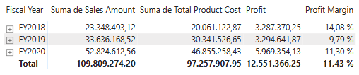

7. Agrega un objeto visual **Gráfico de columnas apiladas y líneas**, ajústale el tamaño y colócalo en la parte inferior de la matriz, de modo que rellene el ancho restante de la página.
8. Añade los siguientes cuatro campos al objeto visual:

     - Eje X: **Product[Category]**.
     - Eje Y columna: **Sales [Order Quantity]**.
     - Eje Y línea: **Sales [Profit Margin]**.

9. Da formato a los objetos visuales de la matriz y del gráfico de columnas apiladas y de líneas: aumenta el tamaño de la fuente y cambia el color.

     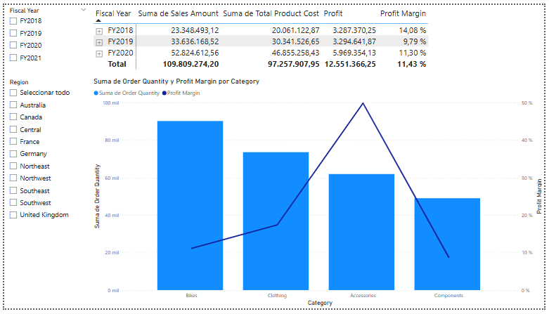

10. Guarda el archivo de Power BI Desktop.

✅ *¡Muy bien! Has completado el diseño de la segunda página del informe.*

---

### Tarea 3. Mejorar la experiencia del usuario.

#### **Sincronizar segmentaciones:**

En esta tarea, vas a sincronizar las segmentaciones **Fiscal Year** y **Región**.

1. En Power BI Desktop, en la página **Información general**, establece la segmentación **Fiscal Year** en **FY2018**.
2. Dirígete a la página **Profit** y observa que la segmentación **Fiscal Year** muestra otro valor.

    > ⚠️ *Cuando las segmentaciones no están sincronizadas, pueden generar una representación errónea de los datos y confundir a los usuarios. Ahora vas a sincronizar las segmentaciones del informe.*

3. Vuelve a la página **Información general** y selecciona la segmentación **Fiscal Year**.
4. En la ficha de cinta **Ver**, dentro del grupo **Mostrar paneles**, haz clic en **Sincronizar segmentaciones**.

     

5. En el panel **Segmentaciones de sincronización** (a la izquierda del panel **Visualizaciones**), en la segunda columna (que representa la sincronización), activa las casillas de las páginas **Información general** y **Profit**.

     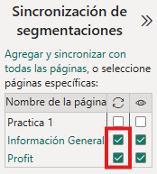

6. En la página **Información general**, selecciona la segmentación **Región** y repite el proceso para sincronizarla.
7. Asimismo, sincroniza la segmentación con las páginas **Información general** y **Profit**.

     

8. Para probar las segmentaciones de sincronización, selecciona otras opciones de filtrado y comprueba que las segmentaciones sincronizadas filtran por la misma selección.

9. Para cerrar la página de **Sincronizar segmentación**, haz clic en **Sincronizar segmentación** situada en la ficha de cinta **Vista**.

#### **Adición de marcadores y botones:**

En esta sección, vas a mejorar la página **Profit** con botones, lo que permitirá a los usuarios del informe elegir el tipo de objeto visual que desean ver.

1. Ve a la página **Profit**. En la ficha de cinta **Ver**, dentro del grupo **Mostrar paneles**, selecciona **Marcadores**.

    

2. En la misma cinta, dentro del grupo **Mostrar paneles**, selecciona **Selección**.
3. En el panel **Selección**, situado junto a uno de los elementos **Matriz**, haz clic en el ícono del ojo para ocultar el objeto visual.

    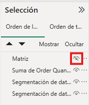

4. En el panel **Marcadores**, haga clic en **Agregar**.

    > 💡 ***Nota:*** *Para cambiar el nombre del marcador, da doble clic sobre él.*

    

5. Si el gráfico visible es el Gráfico de barras, cambia el nombre del marcador por **Gráfico de barras ON**. De lo contrario, nómbralo **Matriz ON**.

6. Para editar el marcador, en el panel **Marcadores**, pasa el cursor sobre él, haz clic en los puntos suspensivos **(...)** y, a continuación, selecciona **Datos**.

    > ⚠️ *Deshabilitar la opción **Datos** significa que el marcador no usará el estado de filtro actual. Esto es importante, ya que de lo contrario el marcador quedaría bloqueado con el valor seleccionado en la segmentación **Fiscal Year**.*

     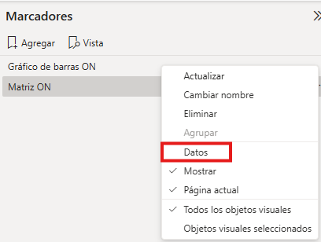

7. Para actualizar el marcador, haz clic nuevamente sobre los puntos suspensivos y selecciona **Actualizar**.

    > ⚠️ *En los pasos siguientes, vas a crear y configurar un segundo marcador para mostrar el otro objeto visual.*

8. En el panel **Selección**, alterna la visibilidad de los elementos: oculta el objeto visual que estaba visible y muestra el que estaba oculto.

9. Crea un segundo marcador y asígnale el nombre correspondiente (**Matriz ON** o **Gráfico de barras ON)**.

     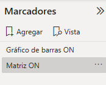

10. Configura el segundo marcador para que omita los filtros (opción **Datos** desactivada) y actualízalo.
11. En el panel **Selección**, asegúrate de que ambos objetos visuales estén visibles. Solo necesitas mostrar el que estaba oculto.
12. Ajusta el tamaño y la posición de los dos objetos visuales para que se superpongan por completo y ocupen todo el espacio disponible en la página.

    > 💡 ***Nota:** Para seleccionar el objeto visual que está oculto, selecciónalo en el panel **Selección**.*

13. En el panel **Marcadores**, haz clic en cada marcador y observa que solo uno de los objetos visuales sea visible.

    > 💡 ***Nota:** En la siguiente fase, agregarás dos botones a la página para que el usuario pueda cambiar entre los marcadores.*

14. En la cinta **Insertar**, dentro del grupo **Elementos**, haz clic en **Botón** y selecciona **En blanco**.

     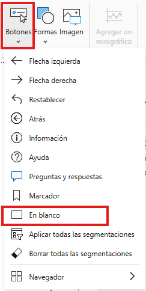

15. Coloca el botón justo debajo de las segmentaciones.

16. Selecciona el botón y, en el panel **Botón de formato**, haz clic en **Botón**. Expande la sección **Estilo** y establece la propiedad **Texto** a **Activado**.

     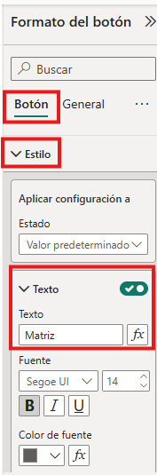

17. Expande la sección **Texto** y escribe **Matriz** en el cuadro de texto.
18. Expande la sección **Rellenar** y, a continuación, aplica un color de fondo a través un color complementario.
19. En la sección **Botón** y activa la propiedad **Acción**.

    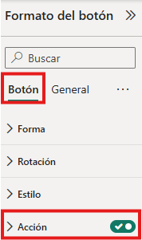

20. Expande la sección **Acción** y, en la lista desplegable **Tipo**, selecciona **Marcador**.
21. En la lista desplegable **Marcador**, elige **Matriz ON**.

    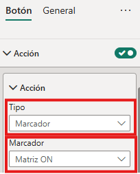

22. Crea una copia del botón usando **Ctrl+C** seguido de **Ctrl+V**, y luego configura el botón nuevo de la siguiente manera:

    - Establece la propiedad **Texto del botón** en **Gráfico de barras**.
    - En la sección **Acción**, establece la lista desplegable **Marcador** en **Gráfico de barras ON**.

✅ ¡Listo! Has completado el diseño del informe.

## Resultado esperado:

Al finalizar el laboratorio, tu informe debería verse similar a la siguiente imagen:

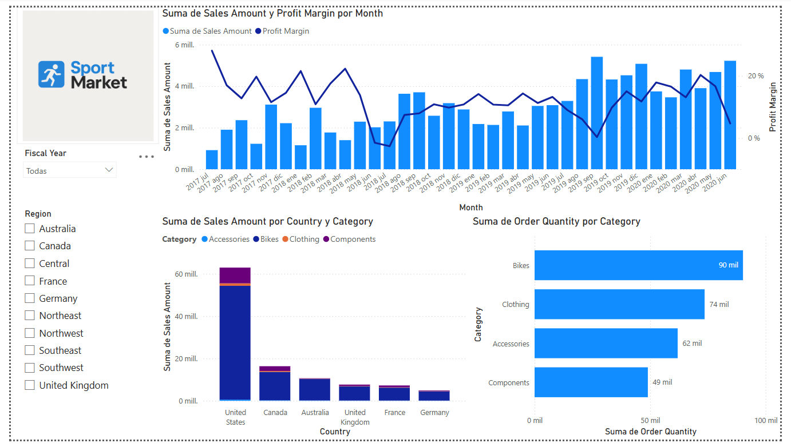 

---

**[⬅️ Atrás](https://netec-mx.github.io/PBI_ESS-Priv/Cap%C3%ADtulo1/)** | **[Lista general](https://netec-mx.github.io/PBI_ESS-Priv/)** | **[Siguiente ➡️](https://netec-mx.github.io/PBI_ESS-Priv/Cap%C3%ADtulo3/)**
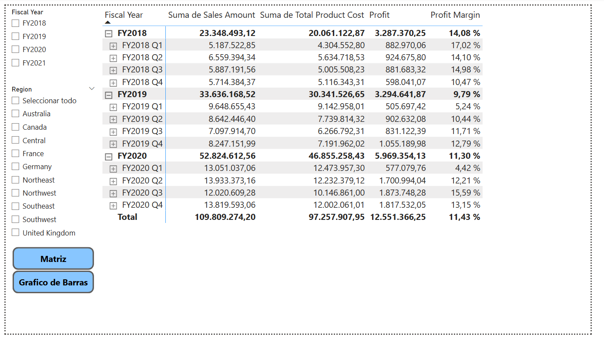
