# Práctica 3. Exploración de Power BI Service y creación de dashboard

## Objetivo de la práctica:
Al finalizar la práctica, serás capaz de:
- Publicar y compartir un informe al servicio de Power BI.
- Crear un dashboard interactivo.
- Diseñar el informe para dispositivos móviles.

## Duración aproximada:
- 80 minutos.

---

**[⬅️ Atrás](https://netec-mx.github.io/PBI_ESS-Priv/Cap%C3%ADtulo2/)** | **[Lista general](https://netec-mx.github.io/PBI_ESS-Priv/)** 

---
## Instrucciones:

### Tarea 1. Iniciar sesión y crear un área de trabajo.

1. Abre tu navegador e ingresa a: [https://app.powerbi.com](https://app.powerbi.com)
2. Inicia sesión con tu cuenta de Power BI.

    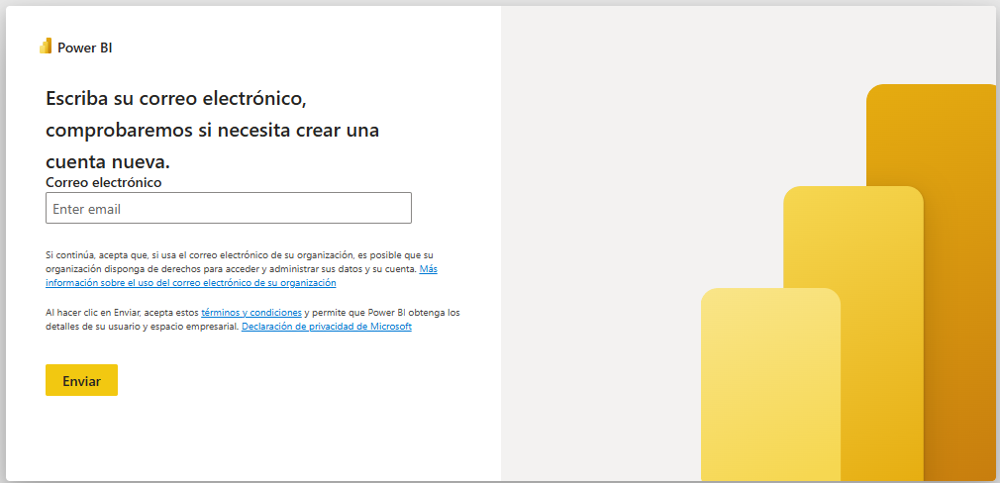

3. En el panel izquierdo, haz clic en **Áreas de trabajo ➡️ Crear un área de trabajo**.
    
    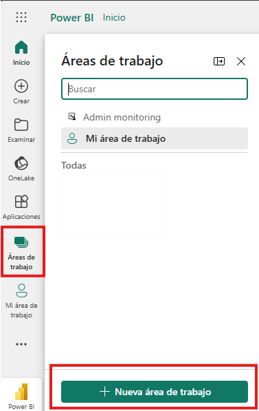

4. Asigna un nombre al área, por ejemplo: **Informes de ventas** (o cualquier otro nombre relacionado con tu proyecto).
5. **Opcional:** Agrega una descripción y una imagen al área de trabajo.

    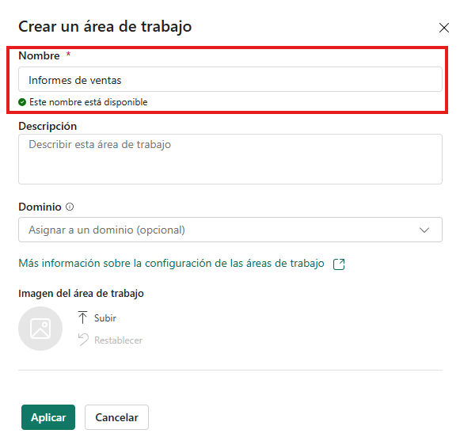

6. Haz clic en **Guardar**.

---
### Tarea 2. Publicar el informe en Power BI Service.

1. Abre el archivo `PBI_ESS_PRIV.pbix` en Power BI Desktop.
2. En la cinta de opciones, selecciona **Inicio ➡️ Publicar**.

    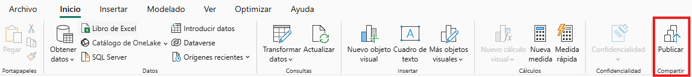

3. Inicia sesión con tu cuenta de Power BI (esta vez desde la aplicación de escritorio).

    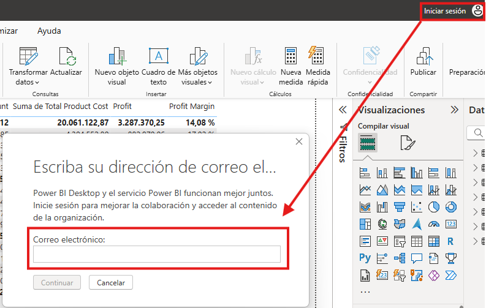

4. Selecciona el área de trabajo que creaste, por ejemplo: **Informes de ventas** (o el nombre que hayas elegido).

    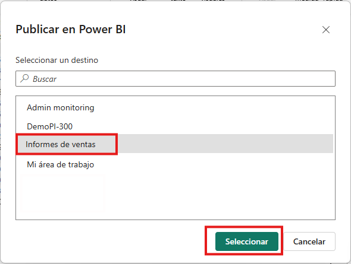

5. Haz clic en **Seleccionar**.

    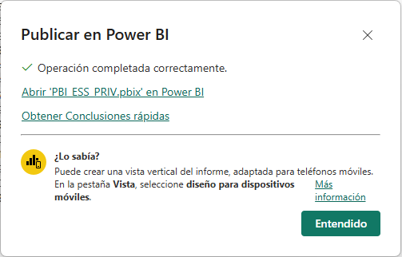

---
### Tarea 3. Verificar la publicación en el servicio Power BI.

1. Abre tu navegador e ingresa a [https://app.powerbi.com](https://app.powerbi.com).
2. Navega al área de trabajo creada: **Informes de ventas**.

    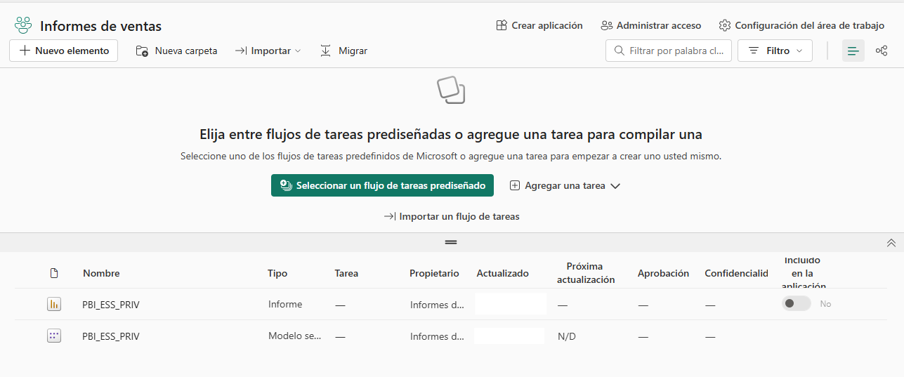

3. Abre el informe que acabas de publicar.

    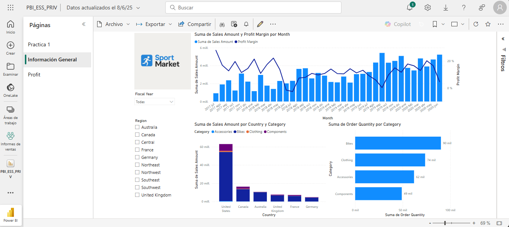

4. Revisa que las visualizaciones se comporten igual que en Power BI Desktop.

---

### Tarea 4. Compartir el reporte con otros usuarios.

> 💡 ***Nota:** Esta funcionalidad requiere que tanto tú como el destinatario tengan licencias Power BI Pro o acceso a capacidad Premium.*

1. Abre el informe desde el serviciode Power BI.
2. En la cinta superiror, haz clic en **Compartir**.
3. Escribe el correo electrónico de otro usuario dentro de tu organización.
4. Añade un mensaje personalizado y haz clic en **Enviar**.
    
    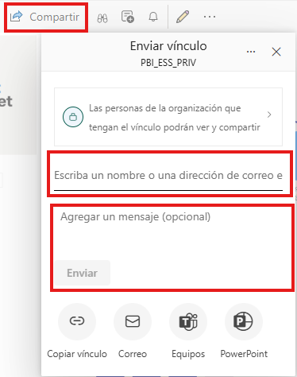

5. Confirma que el usuario tenga acceso al área de trabajo.

> 💡 ***Nota:** Si alguien te compartió un área de trabajo, revisa que ahora tengas acceso y explora los informes que contiene.*

---
### Tarea 5. Explorar la relación entre reportes y datasets.

1. En el panel lateral, accede al área de trabajo creada: **Informes de ventas**.
2. Verifica que el dataset (modelo semántico) asociado al informe tiene el mismo nombre y ábrelo.
3. En la cinta de opciones superior, dar clic en **Linaje ➡️ Abrir linaje del área de trabajo**.

    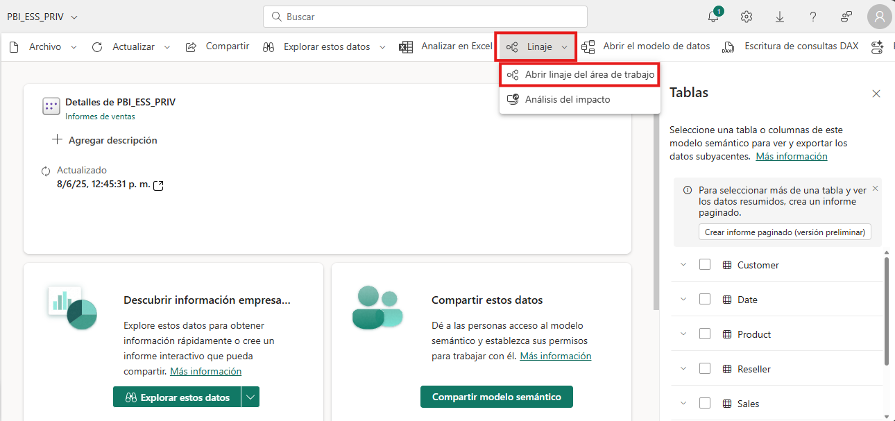

4. Revisa los elementos en el linaje del informe publicado.

    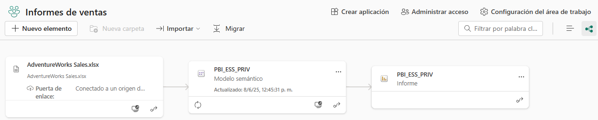

5. Crea un nuevo informe desde ese dataset:
   - Haz clic en los tres puntos (…) ➡️ **Crear informe automático**.
        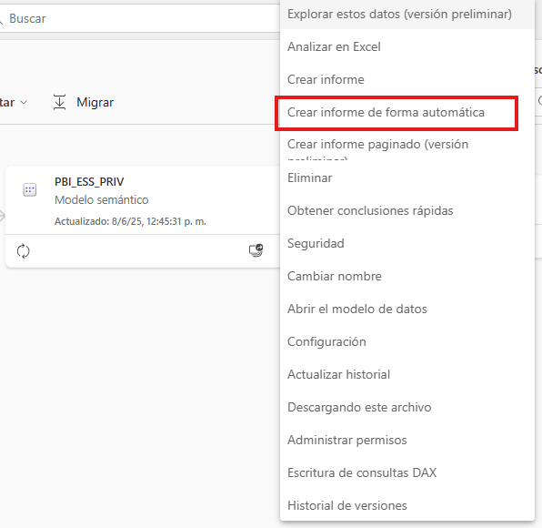

    > 💡 ***Nota:** El resultado del informe creado puede variar, ya que se genera automáticamente.*
    
    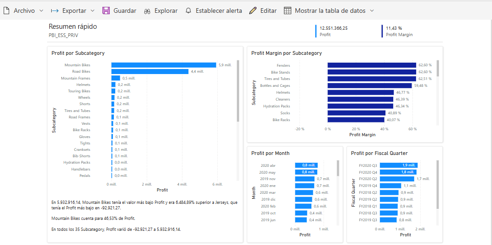

   - En la cinta superior, selecciona la opción **Guardar**, elige el área de trabajo y asigna un nombre al informe creado.
    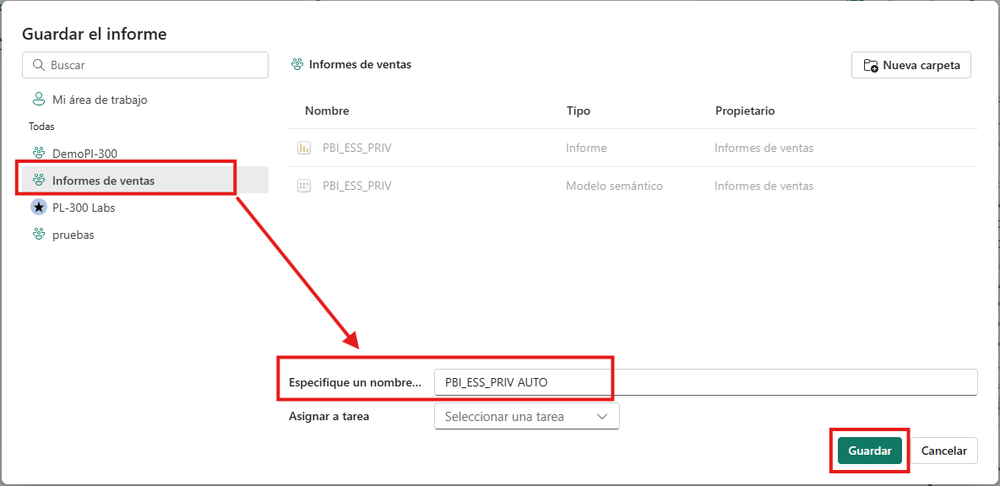

   - Guarda el informe.

> 💡 ***Nota:** De esta forma, confirmas que varios reportes pueden reutilizar un mismo modelo de datos publicado.*

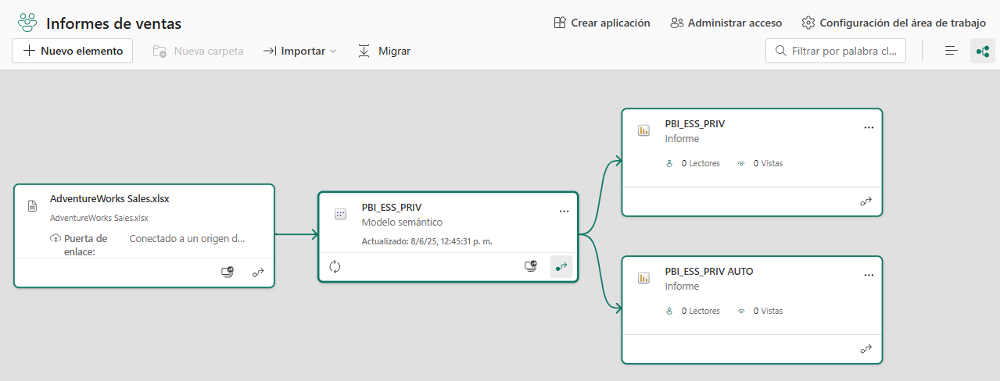

---

### Tarea 5. Crear dashboards.

#### Tarea 5.1. Fijar visualizaciones a un dashboard.

1. Abre el informe publicado en **PBI_ESS_PRIV**.
2. En la página **Información General**, posiciona el mouse sobre el **gráfico combinado de columnas y líneas**.
3. Haz clic en el ícono de **pin(📌)**.

    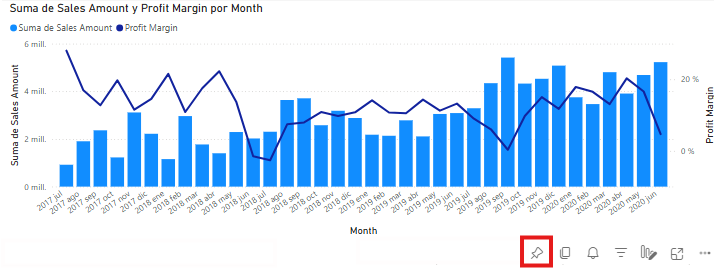

4. En la ventana emergente:
   - Selecciona **Nuevo panel**.
   - Nombra el dashboard: `Panel Ejecutivo de Ventas`.
   - Haz clic en **Anclar**.

   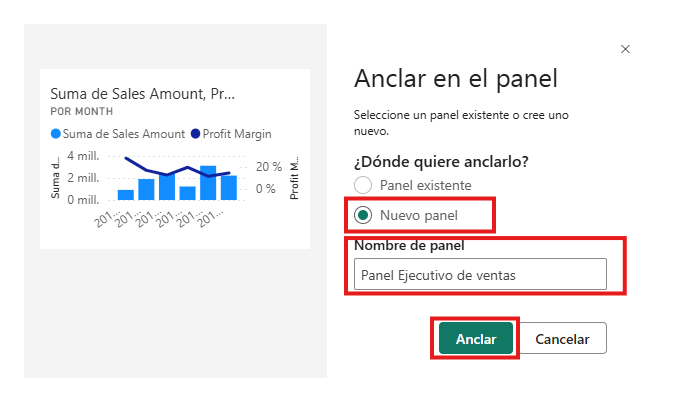

> 💡 ***Nota:** Al anclar el primer objeto visual, se crea el dashboard. Puedes acceder desde el área de trabajo con el nombre que hayas especificado.*

5. Fijar nuevos elementos de los informes:
   - PBI_ESS_PRIV
   - PBI_ESS_PRIV AUTO

6. Verifica que todos los elementos fijados se visualicen correctamente.
    
    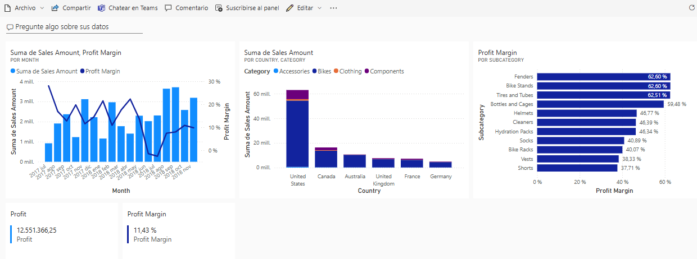

---
### Tarea 6. Diseñar vista para dispositivos móviles.

1. En el dashboard, haz clic en **Editar ➡️ Diseño para móviles**.

    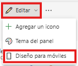
2. Reorganiza los tiles (íconos) en forma vertical para que se adapten correctamente a pantallas pequeñas.

    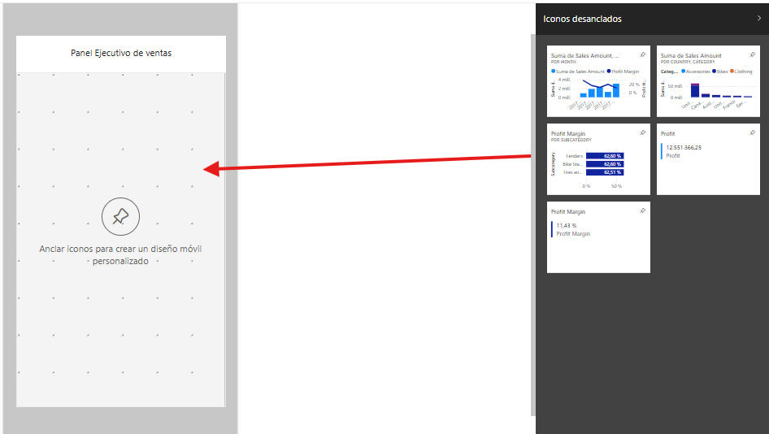

    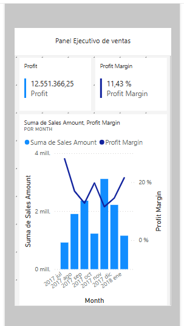

3. Para regresar al diseño original, da clic en **Diseño Web** en la vista de diseño móvil.

    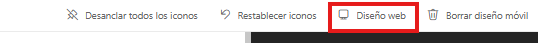

---
## Resultado esperado:

Al finalizar el laboratorio se espera que el resultado sea similar a la siguiente imágen:

---

¡Felicidades! Con esta práctica concluyes el ciclo completo de un flujo profesional de trabajo en Power BI: desde la conexión a datos hasta la publicación y consumo final del análisis.
